# 🧠 RAG PDF API

A robust, lightweight **Retrieval-Augmented Generation (RAG)** API built with **FastAPI**, **ChromaDB**, **PyMuPDF**, and **Groq Cloud (Llama 3.1)**. This API allows users to upload PDF documents, automatically parse and index their text in a vector database, and ask questions with answers generated strictly from the document's context.

---

## 🚀 Features

- **Fast PDF Ingestion**: Extracts text from PDF files in real-time using `PyMuPDF`.
- **Intelligent Chunking**: Employs LangChain's `RecursiveCharacterTextSplitter` to partition text into context-rich blocks.
- **Local Embeddings**: Computes text embeddings using the state-of-the-art `all-MiniLM-L6-v2` Sentence Transformer model locally.
- **Vector Database**: Persists and queries embeddings using ChromaDB (local persistence client).
- **LLM Reasoning**: Integrates Groq Cloud API's `llama-3.1-8b-instant` model for fast, accurate context-based answering.
- **Strict Context Boundary**: Instructs the LLM to only answer queries based on the provided context, preventing hallucinations.

---

## 🛠️ Architecture Workflow

The system operates in two phases: **Ingestion** and **Querying**.

```mermaid
graph TD
    subgraph Ingestion Phase
        A[Upload PDF] --> B[PyMuPDF Text Extraction]
        B --> C[Recursive Chunking]
        C --> D[SentenceTransformer Embeddings]
        D --> E[(ChromaDB Vector Store)]
    end

    subgraph Querying Phase
        F[Query Question] --> G[SentenceTransformer Embeddings]
        G --> H[ChromaDB Vector Query]
        H --> I[Retrieve Top-K Context Chunks]
        I --> J[Construct Prompt Context]
        J --> K[Groq LLM Llama 3.1]
        K --> L[Generate Answer]
    end
```



---

## 📦 Tech Stack

- **Framework**: [FastAPI](https://fastapi.tiangolo.com/)
- **Text Extraction**: [PyMuPDF](https://pymupdf.readthedocs.io/)
- **Chunking**: [LangChain Text Splitters](https://python.langchain.com/docs/modules/data_connection/document_transformers/)
- **Embeddings Model**: `all-MiniLM-L6-v2` via [SentenceTransformers](https://sbert.net/)
- **Vector DB**: [ChromaDB](https://www.trychroma.com/)
- **LLM API Provider**: [Groq Cloud](https://console.groq.com/)
- **Model**: `llama-3.1-8b-instant`

---

## 🔧 Installation & Setup

### Prerequisites
- Python 3.10+
- A Groq API Key (get yours free at [Groq Console](https://console.groq.com/))

### 1. Clone the Repository
```bash
git clone https://github.com/yourusername/rag-pdf-api.git
cd rag-pdf-api
```

### 2. Set Up Virtual Environment
```bash
python -m venv venv
# On Windows
.\venv\Scripts\activate
# On macOS/Linux
source venv/bin/activate
```

### 3. Install Dependencies
```bash
pip install -r requirements.txt
```

### 4. Configure Environment Variables
Copy the template `.env.example` to `.env` and fill in your Groq API key:
```bash
cp .env.example .env
```
Open `.env` and configure:
```env
GROQ_API_KEY=gsk_your_actual_groq_api_key_here
```

### 5. Run the Server
```bash
uvicorn app.main:app --reload
```
The server will start at `http://127.0.0.1:8000`.

---

## 📡 API Endpoints & Usage

Interactive API documentation (Swagger UI) is available at: **`http://127.0.0.1:8000/docs`**

### 1. Ingest PDF (`POST /ingest`)
Upload a PDF file to parse, chunk, embed, and store in ChromaDB.

**Request:**
```bash
curl -X 'POST' \
  'http://127.0.0.1:8000/ingest' \
  -H 'accept: application/json' \
  -H 'Content-Type: multipart/form-data' \
  -F 'file=@/path/to/your/document.pdf;type=application/pdf'
```

**Response Example:**
```json
{
  "message": "PDF ingested successfully",
  "chunks_stored": 42
}
```

### 2. Query PDF (`POST /query`)
Submit a question to retrieve relevant chunks and generate an answer from the ingested document(s).

**Request:**
```bash
curl -X 'POST' \
  'http://127.0.0.1:8000/query' \
  -H 'accept: application/json' \
  -H 'Content-Type: application/json' \
  -d '{
  "question": "What is the primary conclusion of the study?",
  "top_k": 3
}'
```

**Response Example:**
```json
{
  "question": "What is the primary conclusion of the study?",
  "answer": "Based on the provided document, the primary conclusion is that implementing RAG architectures reduces LLM hallucinations by up to 85% in domain-specific tasks.",
  "sources": [
    "Text chunk containing conclusion details...",
    "Another supporting text chunk..."
  ]
}
```

---

## 🔒 Security & Git Safety
This project has been pre-configured with a `.gitignore` to prevent committing development caches and private credentials:
- `venv/` (Local virtual environment)
- `.env` (Private API keys)
- `chroma_db/` (Local SQLite database state)


